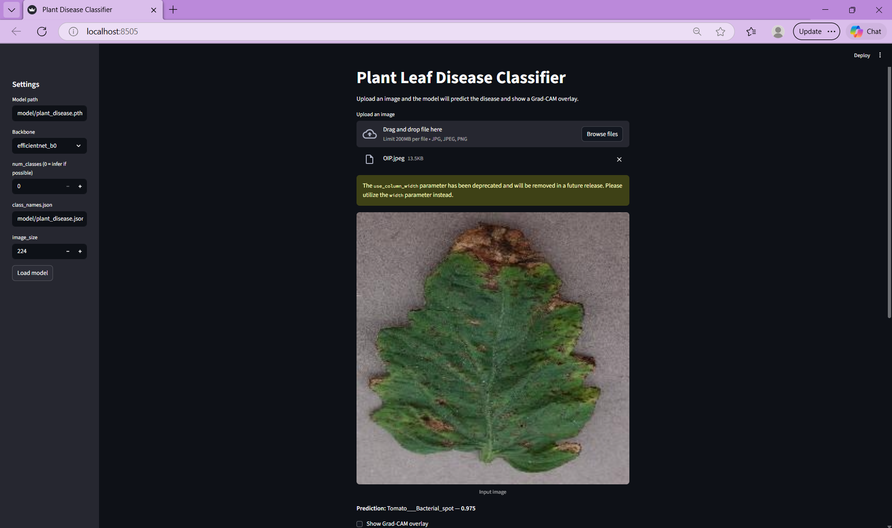

# CNN Plant Disease Detection

Simple PyTorch-based project to predict plant leaf diseases from images using a pretrained CNN model.

## Install

- Create and activate a virtual environment (recommended).
- Install dependencies:

```
pip install -r requirements.txt
```

## Usage

- Place the trained model files in the `model/` directory (`plant_disease.pth` and `plant_disease.json`).
- Run the app or prediction script (examples):

```
python app.py
python predict.py --image path/to/leaf.jpg
```

## Demo



## Notes

- Model and utility code are in the `src/` folder and root scripts (`app.py`, `predict.py`, `model_loader.py`).
- If you want, I can add a short example prediction snippet to this README.
